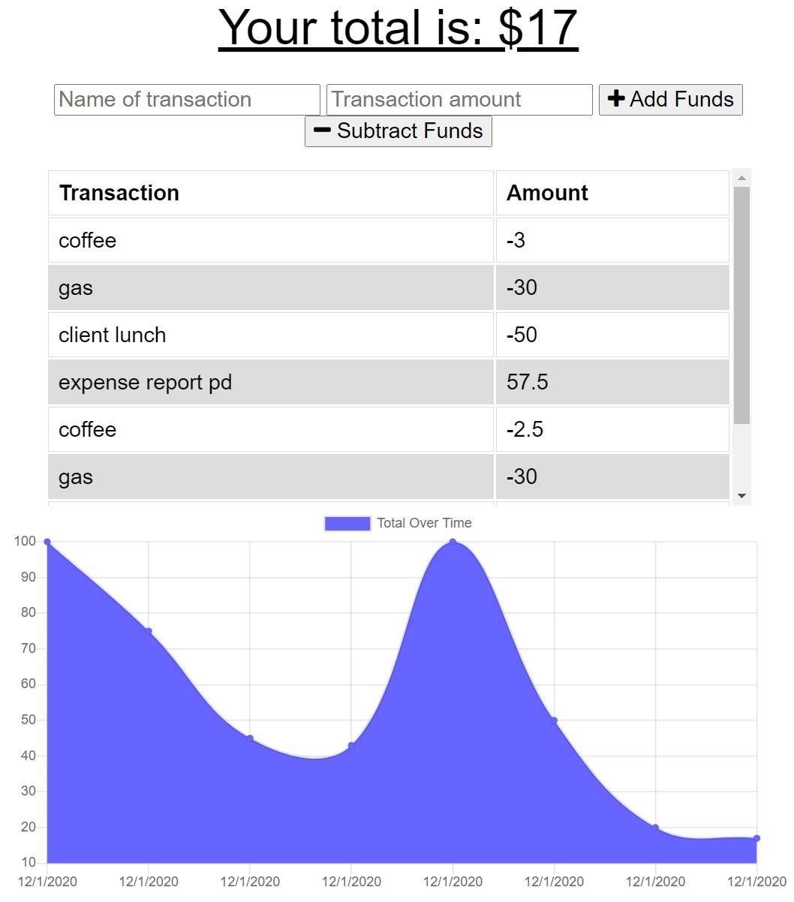

# Expense Tracker

## Description
This is an application that lets you track expenses. It's a Progressive Web Application (PWA), so you can add expenses and deposits with or without a connection.

## Table of Contents
* [Installation](#Installation)
* [Application use](#Usage)
* [Contribution Guidelines](#Contribution)
* [Tests](#Tests)
* [License](#License)
* [Questions](#Questions)

## Installation
This is deployed web application, so no installation is required. Check it out at Demo of the app: https://frozen-crag-53833.herokuapp.com/

## Usage
Track your balance over time visually using the built-in chart! You can pre-fund your account before you begin tracking expeneses to make sure you stay on budget. Or just track expenses - a negative balance is OK! The app works whether you're connected to the internet or not. 

Application: 
 

## Contribution
Submit bug and feature requests as issues through the GitHub repo.

## Tests
None

## License
This app can be used under the terms of the MIT license.

## Questions
For questions, please contact <cmetzjr@yahoo.com>. 
GitHub repo: https://github.com/cmetzjr/expense-tracking-pwa
